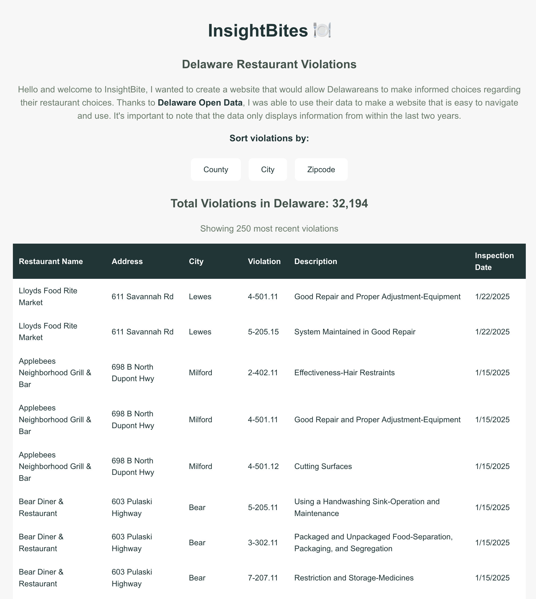

# InsightBites 🍽️ - Transparent Restaurant Safety in Delaware

[](https://opensource.org/licenses/MIT)


## Overview

InsightBites transforms Delaware's restaurant health inspection data into an accessible, user-friendly web application. Born from a University of Delaware HenHacks 2024 project, this tool empowers Delaware residents to make informed dining choices by providing transparent access to health code violations across the state.

[Live Demo (none atm)](#) | [API Documentation](https://data.delaware.gov/Health/Restaurant-Inspection-Violations/384s-wygj/about_data)



## Project Evolution

### InsightBites (current version)
- Modern React web application
- Real-time data fetching from Delaware Open Data API
- Interactive UI with smooth animations
- Professional styling with Tailwind CSS
- Enhanced filtering capabilities

### accountable restaurants delaware (original from HenHacks 2024)
- Command-line interface built with TypeScript
- Used Node's `fs` and `prompt-sync` libraries
- CSV file parsing for data management
- Basic sorting functionality by location

## Features

### Advanced Filtering
- **County View**: Browse violations by Sussex, Kent, or New Castle counties
- **City Search**: Filter by specific Delaware cities
- **Zipcode Search**: Locate violations in your area

### Data Visualization
- Clear, responsive table layout
- Real-time violation counts
- Most recent violations displayed first

## Technical Stack

- **Frontend**: React with TypeScript
- **Styling**: Tailwind CSS
- **Data**: Delaware Open Data API
- **HTTP Client**: Axios
- **State Management**: React Hooks

## Getting Started

1. **Clone the repository**
   ```bash
   git clone https://github.com/marcosdiazvazquez/InsightBites.git
   cd InsightBites
   ```
2. **Install dependencies**
    ```bash
    npm install
    ```
3. **Set up environment variables**
    ```bash
    cp .env.example .env

    # In .env, set the following variable:
    
    API_KEY=your_delaware_open_data_api_token
    ```
4. **Start the development server**
    ```bash
    npm run dev
    ```

## License
This project is licensed under the MIT License - see the LICENSE file for details.

## Acknowledgments

- Delaware Open Data for providing the API
- [Dhruv Patel](https://github.com/rkdhruv) for working on AR-DE with me

## Contact
For any queries regarding this project, please reach out to Marcos through mdv@udel.edu
